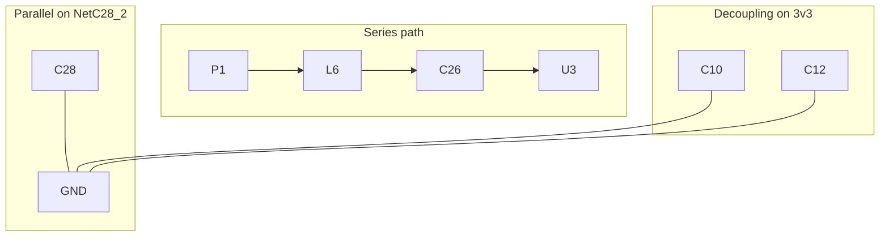

# Net topology — series paths vs parallel branches

## The mistake agents make

`trace_connection` returns **one shortest path** between two parts. It does **not** list everything electrically tied to that signal.

Parallel items are **invisible** to `trace_connection` unless they sit on that shortest route:

- RF **shunt caps** (one leg on the node, one on GND)
- **Decoupling caps** on power rails (3V3 ↔ GND)
- Other loads, test points, or passives on the **same net**

**Never stop after `trace_connection`.** Always run the **net fanout audit** below before answering.

---

## Mental model

| View | Tool | Shows |
|------|------|--------|
| One path A → B | `trace_connection` | Series hops only |
| Everyone on a wire | `get_net(name)` | **All** pins on that net |
| Both pins of one part | `get_component(des)` | Full pin ↔ net map |

Schematic connectivity is a **graph of nets**, not a single line. Report **series** and **parallel** separately.

---

## Mandatory workflow (net fanout audit)

Use this **every time** the user asks how something connects, traces a signal, or asks about caps/decoupling.

```
1. reload_connectivity
2. get_connectivity_status          → has_usable_nets must be true
3. get_pin_connection(A, pin)       → starting net(s)
4. trace_connection(A, B, pins…)    → series path + nets_on_path / steps
5. NET FANOUT AUDIT (required):
   a. Collect net names:
      - every net in trace_connection result (steps type "net", or nets list)
      - net from get_pin_connection on start AND end pins
   b. For EACH unique net name → get_net(name)
   c. From each get_net result, list every connection (designator.pin)
   d. For every passive (C*, R*, L*, FB*, D* with 2 pins):
      → get_component(designator)
      → classify (shunt / series / decoupling) — see rules below
6. If any endpoint is an IC → POWER RAIL AUDIT (below)
7. Answer using three blocks: Series | Parallel on nodes | Decoupling/GND
```

If step 5 was skipped, the answer is **incomplete**.

---

## How to spot a shunt or decoupling cap

After `get_component("C28")` (example):

```json
"pins": [
  { "number": "1", "net": "GND" },
  { "number": "2", "net": "NetC28_2" }
]
```

**Shunt to GND (RF or AC):** one pin on **GND** (or AGND/DGND), other pin on the **signal net** you are analyzing.

**Decoupling (power):** one pin on a **power rail** (`3v3`, `3V3`, `VCC`, `VDDA`, …), other pin on **GND**.

**Series element:** both pins on **different** nets that are **not** GND ↔ signal/power shunt pattern — e.g. L6 pin 1 on `NetC26_2`, pin 2 on `NetC28_2` (in the series chain).

GND-like net names (case-insensitive): `GND`, `AGND`, `DGND`, or contains `GND`.

Always include **designator + comment** from `get_component` (e.g. `C28`, `3.3 pF`).

---

## Power rail audit (IC questions)

When the trace involves an IC (U*, IC*, Q*):

1. `get_component("U3")` — list all pins and nets.
2. Find power pins (net name or pin name suggests supply: `3v3`, `VCC`, `VDD`, `VDDA`, …).
3. For each supply net → `get_net("3v3")` (or whatever the export uses).
4. Every **C\*** on that net with other pin on GND → **decoupling cap**; list them all, not just one.

Example: net `3v3` has **17** decoupling caps (C5, C6, C7, C10, C12, …). Listing only the series path to U3 misses all of them unless you call `get_net("3v3")`.

---

## Power pin audit (`trace_power_path`)

**Problem:** User asks “3v3 to VDDP3P — how many decoupling caps?” Tracing rail-to-rail fails because **VDDP3P and 3v3 are often the same net**, or many pins share one rail.

**Fix:** Always start from the **destination IC pin**, trace **back** to the rail.

```
trace_power_path("IC1", "VDDP3P", source_rail="3v3")
```

| Result field | Meaning |
|--------------|---------|
| `connection_type: direct_to_rail` | Pin is on `3v3` directly → all `rail_decoupling_count` caps on 3v3 serve it |
| `connection_type: filtered_path` | Pin on separate net (e.g. NetC11_1) → `local_decoupling` (C11) + `rail_decoupling` (all 3v3 caps) |
| `local_decoupling_count` | Caps on nets **between** rail and pin (pin-specific) |
| `rail_decoupling_count` | Caps on the shared source rail |
| `series_components` | Ferrite/inductor in path (e.g. L2) |

**Pin names:** Re-export from Altium (schema v3+) includes pin `name` field (`VDDP3P`, `VDDA_2`). Until re-export, use pin number from `get_component`.

**Electrical limit:** Schematic nets cannot assign “these 3 of 17 rail caps belong only to VDDP3P” when multiple pins share `3v3` — report `rail_decoupling_count` honestly and list `other_pins_on_same_rail`.

---

## Shared power net names (C8, C9, C10 all on `3v3`)

A common confusion: the schematic **draws** C8 → C9 → C10 → L2 in a line, but MCP assigns **the same net** `3v3` to:

- C8 pin 1, C9 pin 1, C10 pin 1
- L2 pin 1
- Every other load on the board 3.3 V rail

That is **normal Altium compiled connectivity**. Parallel decoupling caps on a power rail share one net name.

**Agent workflow for “what is between 3V3 and VDD3P3_1”:**

1. `trace_power_path("IC1", "VDD3P3_1", source_rail="3v3")` → L2 in series; C11 on filtered net; full `rail_decoupling` list on `3v3`
2. `get_net("3v3")` + `get_component("C8")` etc. → confirm C8/C9/C10 are on **`3v3`↔GND** with values
3. Explain: **same net name** does not mean “not in the path” — they are **parallel** on the rail; only **L2** creates a **new** net (`NetC11_1`) after the inductor
4. Do **not** treat “all caps on 3v3” as an MCP bug; do **not** invent per-cap net names

**Filtered vs direct pins:** `VDD3P3_1` on `NetC11_1` (through L2) vs `VDD3P3_RTC` on `3v3` directly — different `connection_type` in `trace_power_path`.

---

## Reading `get_net` output

Typical shape:

```json
{
  "name": "NetC28_2",
  "connections": [
    { "designator": "P1", "pin": "1" },
    { "designator": "C28", "pin": "2" },
    { "designator": "L6", "pin": "2" }
  ]
}
```

**Interpretation for P1 antenna node:**

| On net NetC28_2 | Role |
|-----------------|------|
| P1.1 | Antenna / entry |
| L6.2 | Series inductor into matching |
| C28.2 | **Shunt** — check C28.1 on GND |

Do not say “P1 connects to L6 only” — say “P1, L6, and C28 pin 2 share NetC28_2; C28 pin 1 is on GND (shunt).”

---

## When `trace_connection` goes through GND

Shortest path may hop **C28 → GND → C23 → U3**. That reflects net membership, not the RF series chain.

For RF answers:

1. Prefer the **series** nets from `get_net` walk (P1 net → … → U3 pin).
2. Still report **GND shunts** found on each of those nets.
3. Do not describe the GND hop as the main signal path unless the user asks for net-level connectivity only.

---

## Diagram rules

Minimum mermaid for a complete answer:



Show parallel branches **split off** the node net, not inline in the series chain.

---

## Quick checklist before sending the answer

- [ ] Called `get_net` on **every** net in the series path
- [ ] Called `get_net` on start/end pin nets from `get_pin_connection`
- [ ] Ran `get_component` on every cap/resistor found on those nets
- [ ] Listed **all** GND shunts on signal nets
- [ ] If IC involved, ran power rail audit (`get_net` on supply nets)
- [ ] Answer has **Series**, **Parallel/shunts**, and **Decoupling** sections
- [ ] Did not infer caps from PDF — only from MCP
